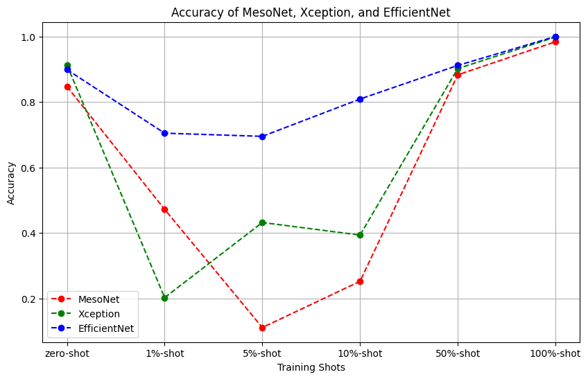

# Few-Shot-Forgery-Detection

 

🚀 Check out the [slide](document/Slide.pdf) or [report](document/Report.pdf) for more detail.

## Goal
We aims to 
1. Classify if a video is real or fake
2. Disscuss transfer learning performance on few-shot sample finetuning

## Dataset (FaceForensics++ & Celeb-DF)

## Detection Pipeline

## Proposed Pipeline

## Training Phase

We first split the video into frames of images array, and then label the images with the same label as the video. 

We then randomize the order of the images and split the images into training set and validation set.

## Testing Phase

In the testing phase, we feed the testing video into the model and get the prediction of each frame. We then calculate the average prediction of all frames in the video and use it as the final prediction of the video.

## Experiment

### Detail
- model pretrained on face forensics ++  c23
    - models: MesoNet(2018), XceptionNet(2016), EfficientNet(2019)
- finetune 1%, 5%, 10%, 50%, 100% Celeb-DF
    - training set: 1%, 5%, 10%, 50%, 100% 
    - validation set: 1%
    - testing set: all Celeb-DF official testing set
- Hyperparameter
    - Loss: Cross Entropy
    - Optimizer: Adam
    - Learning rate: 0.001
    - Scheduler: StepLR, step size=5
    - Epoch
    
    |Shot|1%|5%|10%|50%|100%|
    |---|---|---|---|---|---|
    |Epoch|100|100|100|50|50|

### Transfer Learning

### Few Shot Learning
#### MesoNet

#### Xception

#### EfficientNetB4

### Model Comparison on differnt Metrics
#### F1-Score

#### Accuracy

#### AUC

## Conclusion
- EfficientNet outperforms the other two models when testing few-shot samples

- The difference between real and fake images is really small, it’s very hard to distinguish them by using simple convolutional feature extraction method.

- We think Residual component plays an important role in this task
